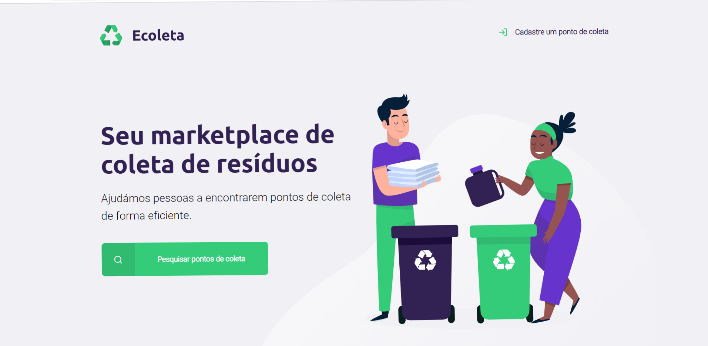

<h1>
    
</h1>


<h2 align = "center">
    Welcome to my first Project
</h2>

# 🚀 Indice
  - [Project](#projecto)
  - [Used Technologies](#tecnologias-usadas)
  - [how to download the project](#-how-to-download-the-project)


##  Project

This project was carried out in the NLW week of **Rocketseat**, it was a week to learn, do a project from beginning to end and learn various techniques and programming tools.

##  Used Technologies

- [HTML](https://html.org/)
- [CSS](https://css.com)
- [Javascript](https://javascript.com)


## 🧮 how to download the project

```bash

   $ git clone https://github.com/NKinta92/Ecoleta

   $ cd Ecoleta

   $ npm install

   $ npm start

```

Developed by Nuno Quinta de Faria 😁